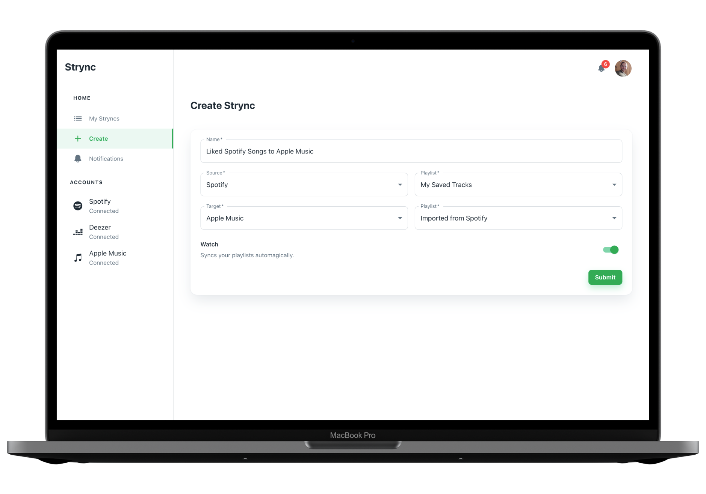
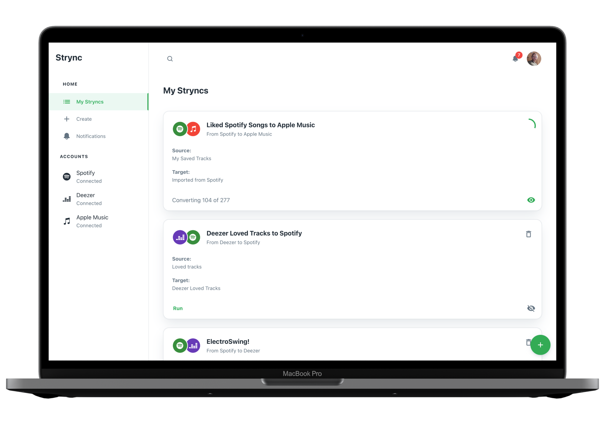
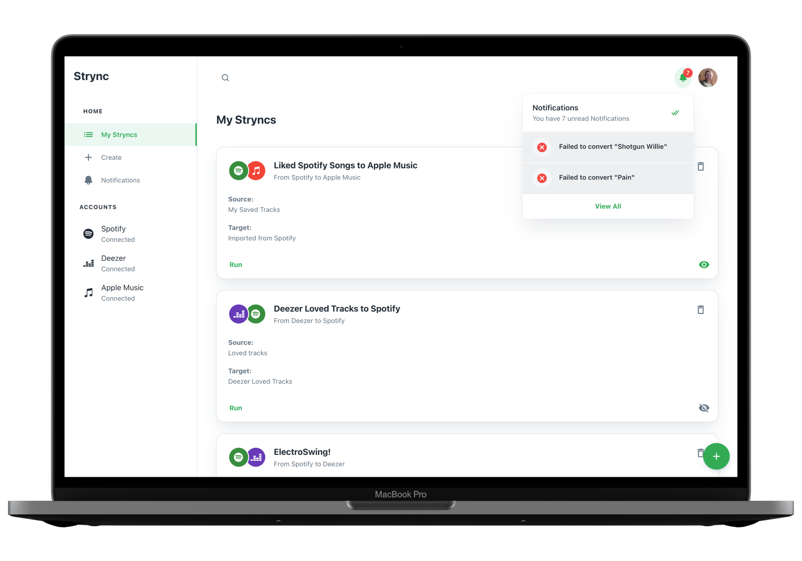
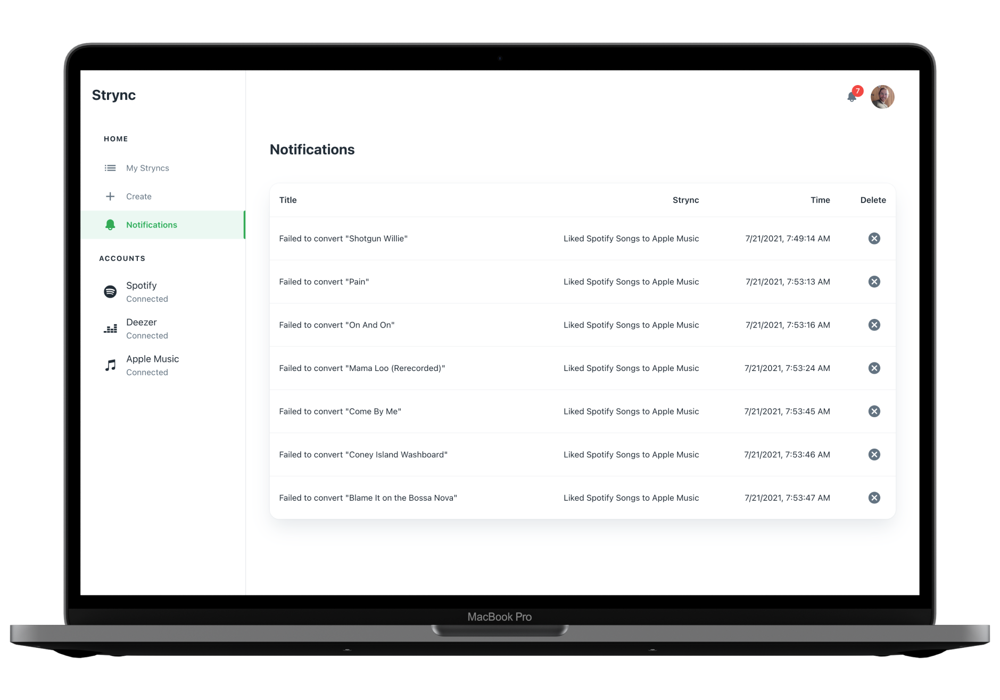

## The Problem

There are a variety of online tools that claim to be able to convert playlists between different music streaming services. While most of them have no problem finding the equivalent recording, none of them respect the particular release a user has chosen to include in their library.

## The Solution

Create a playlist converter that allows users to easily create macro-like tasks that convert playlist between three of the largest streaming services, while being particular about the particular release of the songs.

## Outcome

**Strync** is a web application that allows users to convert playlists between different music streaming services.

Users can connect to Spotify, Deezer and Apple Music and create “Stryncs” (streaming service synchronisations), which contain the instructions for converting songs from one playlist and streaming service to another.

When using Spotify or Deezer, you can treat your library as a playlist source as well.

<figure>
  
  <figcaption>Create a Strync</figcaption>
</figure>

These stryncs are associated with the account a user creates upon signing up.

Users can run the strync manually, or tick the “watch” checkbox, making the process run on a remote server in regular intervals.

<figure>
  
  <figcaption>Running Strync with progress indicator and eye button to indicate it's being watched.</figcaption>
</figure>

<figure>
  
  <figcaption>Filter your Stryncs by clicking the search bar and entering a playlist name or the Strync's name</figcaption>
</figure>

Compared to other playlist converter services, Strync takes pedantic care of choosing the correct release of a song. For example:

Converting the song “Long Black Road” by the Electric Light Orchestra from their 2001 album “Zoom”, the expected behavior would be to find the equivalent release on the target service. However, this is often not the case when using conventional playlist converters.

Instead, the most popular release will be chosen, which tends to be from a compilation album (in this particular case, the soundtrack to “American Hustle”).

Strync makes this possible by taking multiple factors into account when making the transfer.

<figure>
  
  <figcaption>Get notified if no match was found</figcaption>
</figure>

<figure>
  
  <figcaption>Get an overview of all failed conversions</figcaption>
</figure>

Strync aims to eliminate the concern of wrong metadata, which leads to the disintegration of one's carefully curated music library — a prospect that has made many people averse to the thought of changing music streaming providers, even in light of switching to a service they would otherwise enjoy more.

### Built With

- [React.js](https://reactjs.org/)
- [Netlify](https://netlify.com)
- [Spotify API](https://developer.spotify.com/documentation/web-api/)
- [Apple Music API](https://developer.apple.com/documentation/applemusicapi/)
- [Deezer API](https://developers.deezer.com/api)
- [Material UI](https://mui.com/)

## Getting Started

1. [Create an Apple Music JWT token](https://leemartin.dev/creating-an-apple-music-api-token-e0e5067e4281)
2. [Register a Spotify App](https://developer.spotify.com/dashboard/applications) and add http://localhost:8888/login-to-spotify as a Redirect URI in the app settings
3. 2. [Register a Deezer App](https://developer.spotify.com/dashboard/applications) and add http://localhost:8888/login-to-deezer as a Redirect URI in the app settings
4. Create an .env file in the root of the project based on .env.example
5. `npm install netlify-cli -g`
6. `netlify dev`

## License

Distributed under the MIT License. See `LICENSE.txt` for more information.

(<a href="#top">back to top</a>)

## Background

Nowadays, if you decided to switch streaming services, or just synchronize them, you probably would want to take your library with you. This isn’t as platform agnostic as an .mp3 collection used to be, though.

Instead, you’re likely using a streaming service, like Spotify or Apple Music, where, when deciding to leave one vendor for another, you are faced with the challenge of making the transition as seamless as possible.

There do exist services that promise to do this for you without the hassle one would expect, especially if you’ve got a few thousand songs saved in your library. One of those services is Soundiiz.

Soundiiz lets you convert songs from one platform to another. So do SongShift and a variety of open source solutions found on GitHub.

Sadly though, most of these converters do not respect the particular _release_ of a recording. Instead, they mainly work by querying for the **I**nternational **S**tandard **R**ecording **C**ode, or **ISRC**.

While this in fact **does** get you the exact same recording, the _release_ is often a different one: Most of the time, some kind of compilation album, and not the one you originally added to your playlist. Which is a pain if you took the effort to search for a particular release.

This mismatching is most visible in the change of album cover an incorrect conversion is accompanied by.

Many people may not care about this kind of metadata; however, persons like me — who spent entire weekends hunting for the correct album cover to make their meticulously organized offline collection more beautiful — will be furious at the casualness with which the services treat your library.

Since I had to deal with this problem myself for a long time, I know I have yet to see a converter who pays attention to those details.

While there exists [SongShift](https://songshift.com), which allows you to manually review the conversions and allows you to change them, the app still isn’t as stringent as it could be in their algorithm, which makes it not the time-saver I hoped it to be.

Which is why I've decided to take matters into my own hands.

## Technical Details

It is actually possible to employ changes in the conversion algorithm, which can lead to much more reliable results.

Instead of looking up songs by ISRC, _Strync_ first and foremost relies on the UPC album code to make sure the right track is chosen. Only then the ISRC is used for verification purposes.

That being said, there’s no uniform way of transferring songs from one service to another.

For instance, going from Spotify to Deezer is quite simple, since querying Spotify for an ISRC returns a list of track results, which then can either be filtered to see which one matches the correct disc number and track number.

Spotify to Deezer meanwhile requires one to use the UPC method, as Deezer only returns a single result by querying by ISRC (with the corresponding API call not even being officially documented).

While Apple Music also returns a list of songs when searching by ISRC, it isn't of much use: Though it does get you a list of tracks, but — as I had to find out the hard way — some of them aren't available for streaming anymore. So while the API allows you to add them to your library, you’ll be greeted with a greyed out item on your playlist.

Those inconveniences aside, each directionality also provides a fallback method, which can prove useful in certain edge cases.

Most of them default to a strict search query, after which the filtering for common denominators starts over again.

Thus, although requiring few additional requests, using a combined query of ISRC and UPC codes is the way to go. Something many paid services have yet to figure out.

## Expanding on The Features

Currently, the "server" consists of a single GitHub Actions workflow which runs a script every half an hour, querying for users watched Stryncs and executing them. Once the program leaves its alpha stage, an actual server with lower frequencies will be justified.

In addition, adding more services and especially, adding the ability to convert a list of local tracks, are targets for the project.

Certainly an options panel with the ability to finetune the decisions the algorithm makes (such as allowing for compilations if no suitable track was found) are in order as well.
